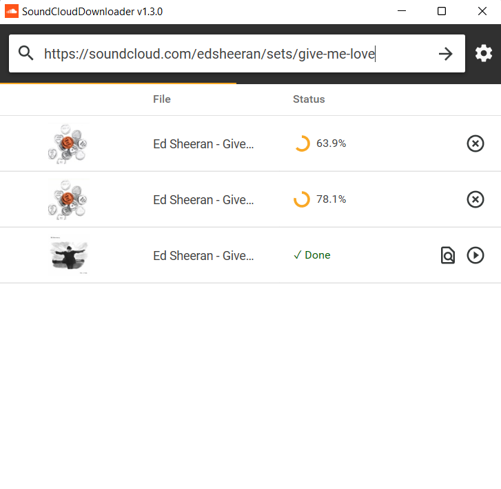
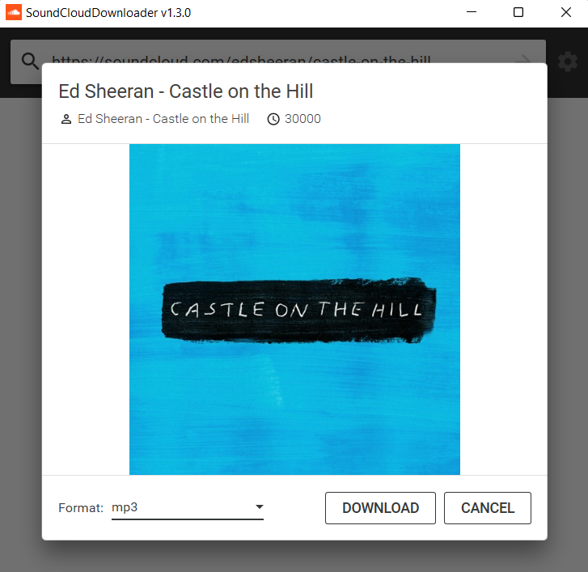
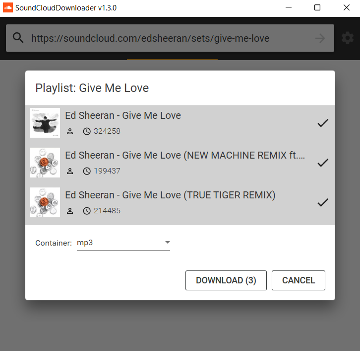

# SoundCloudDownloader

> 🟡 **Project status**: maintenance mode

**SoundCloudDownloader** is an application that lets you download tracks from Soundcloud.
You can copy-paste URL of any track or playlist and download it directly to a format of your choice.

This application uses [**SoundCloudExplode**](https://github.com/jerry08/SoundCloudExplode) under the hood to interact with Soundcloud.

## Download

- 🟢 **[Stable release](https://github.com/jerry08/SoundCloudDownloader/releases/latest)**

## Features

- Download tracks by URL
- Download tracks from playlists
- Automatically inject media tags

## Screenshots

